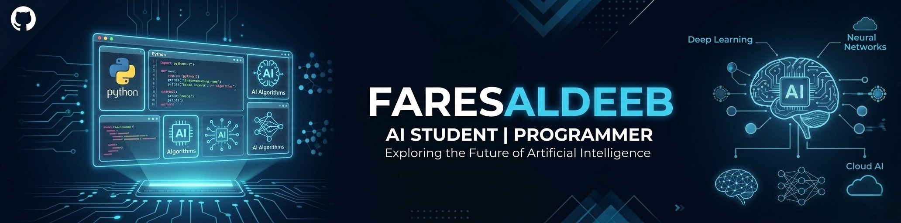

<!--Banner-->

# 👋 Hi, I'm Fares Aldeeb  
*AI Student | Machine Learning & Deep Learning Enthusiast*

---

  
  
  
  
  

  🚀 Building AI systems • 📊 Learning from data • 🧠 Exploring neural networks

---

## 🧠 About Me
🎓 Junior AI student at **UPM (University of Prince Mugrin), Madinah**  
🤖 Passionate about Artificial Intelligence, Machine Learning & Deep Learning  
📊 Working with real datasets and improving model performance  
💻 Focused on Python, data analysis, and neural networks  

---

## 🚀 What I'm Doing
- 🔬 Training Machine Learning & Deep Learning models  
- 📊 Working on Data Mining projects (Kaggle datasets)  
- 🧠 Learning Neural Networks, CNNs, and Deep Learning fundamentals  
- 📈 Improving accuracy and understanding model performance  

---

## 🛠️ Tech Stack
- **Languages:** Python  
- **Libraries:** NumPy, Pandas, Matplotlib  
- **ML/DL:** Scikit-learn, *(learning PyTorch)*  
- **Other Skills:** Data Cleaning, Data Analysis, Problem Solving  

---

## 📂 Projects
- 🔹 Machine Learning Training Project (GPU-based training)  
- 🔹 Data Mining Project (Online Retail Dataset)  
- 🔹 Kaggle Practice Projects  
- 🔹 Deep Learning Experiments *(coming soon)*  

---

## 🎯 Current Goals
- 📌 Master Machine Learning & Deep Learning  
- 📌 Build real-world AI projects  
- 📌 Work with Neural Networks & Computer Vision  
- 📌 Get an internship in AI / Data Science  

---

## 📫 Connect With Me

  

---

## 🌟 Quote
> “The best way to learn AI is by building and failing fast.”
